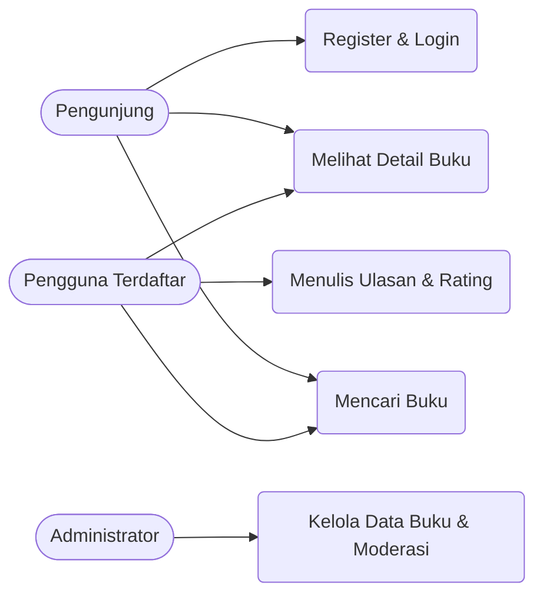
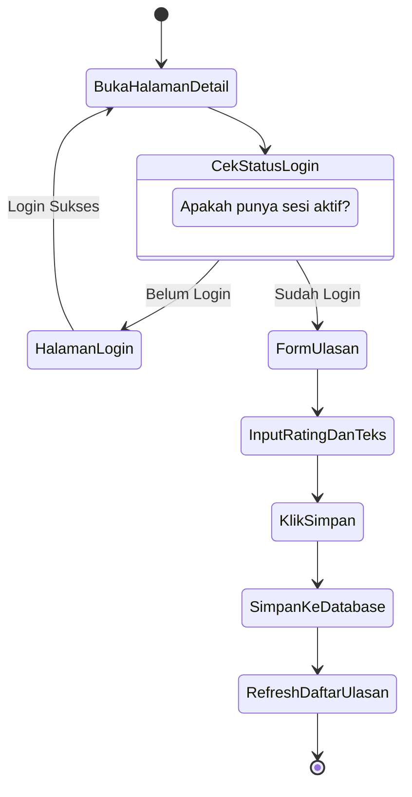
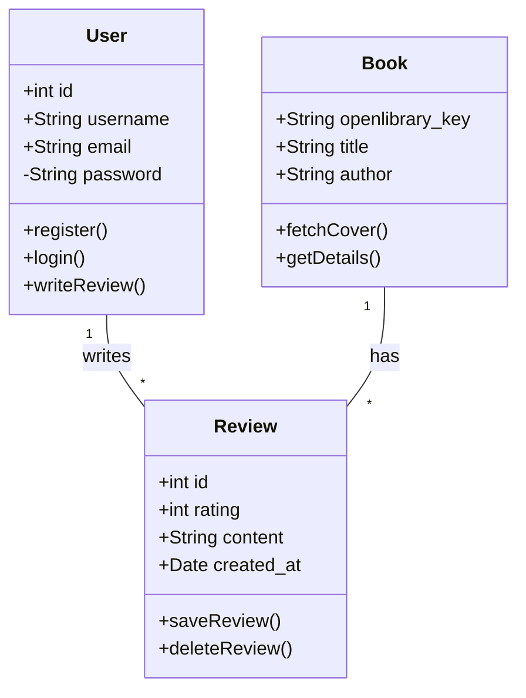
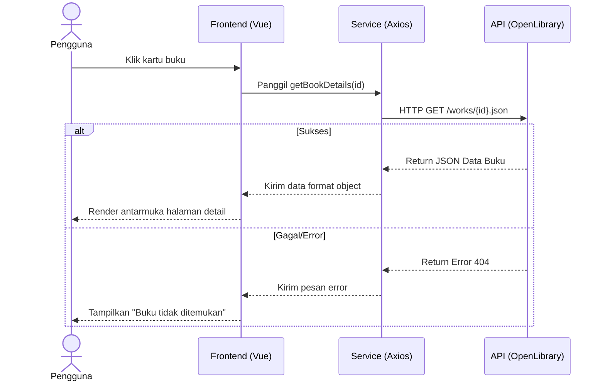
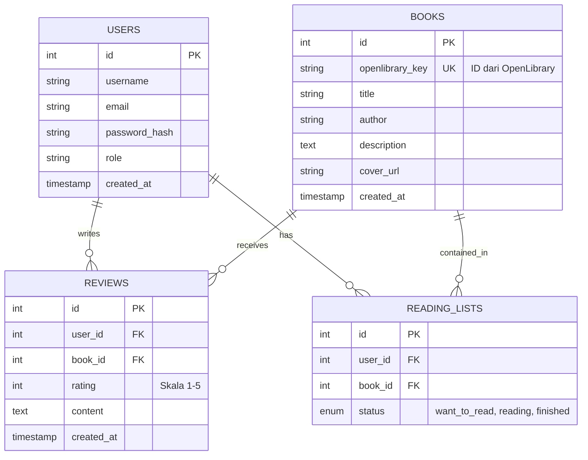

**_Fase Analisis_**

**_*1. Use Case Diagram*_**

**_*2. Activity Diagram*_**

**_Fase Desain_**

**_*1 Class Diagram*_**

**_*2 Sequence Diagram (Skenario: Fetch Detail Buku)*_**

**_*3 ERD *_**

